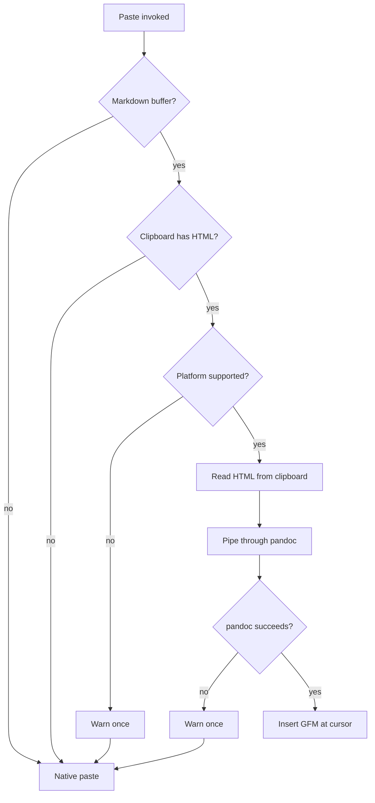
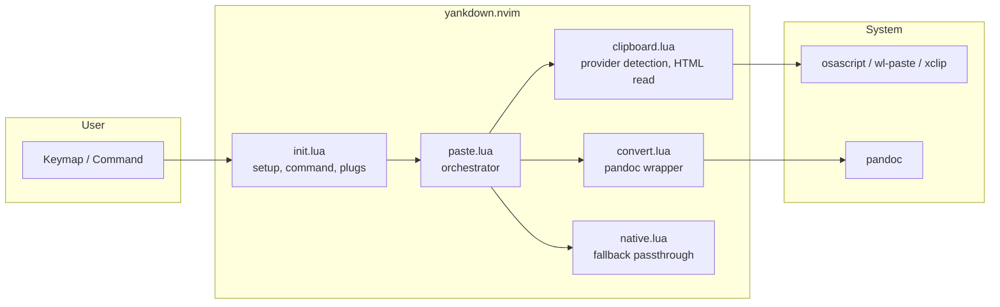

<div align="center">

# yankdown.nvim

**Smart paste for Markdown in Neovim**

[](https://github.com/ntk148v/yankdown.nvim/actions) [](https://lua.org) [](https://neovim.io) [](LICENSE) [](https://github.com/ntk148v/yankdown.nvim/stargazers)

</div>

## Overview

We're past peak prose. Every LLM outputs Markdown. Every answer, every code review, every draft — it's all `## headings`, `- lists`, and ``` backticks. You copy from a browser, a doc, an AI chat — and Neovim gets raw HTML or rich text. Which you then clean by hand. In 2026. While your AI writes in GFM natively.

`yankdown.nvim` fixes that. It pastes rich content from browsers, Google Docs, or Word into Neovim as clean GitHub Flavored Markdown — no intermediate file, no manual conversion.

It reads HTML from the system clipboard, pipes it through `pandoc`, and inserts the result at the cursor. When HTML is unavailable or a required tool is missing, it falls back to native paste transparently.

## How it works



## Features

- **Clipboard HTML → GFM** — paste rich content as clean Markdown, not raw HTML.
- **Auto-fallback** — native paste when HTML is absent, pandoc is missing, or the platform is unsupported.
- **One-time warnings** — `vim.notify` fires once per missing tool, then stays quiet.
- **Multiple paste targets** — normal (after/before cursor), visual (replace selection), insert (at cursor).
- **Optional paste interception** — `p`/`P` auto-override in Markdown buffers only (buffer-local, filetype-scoped).
- **Plug mappings** — `<Plug>(yankdown-paste-after)` and `<Plug>(yankdown-paste-before)` for custom keybindings.

## Architecture



## Requirements

| Dependency                    | Version | Purpose                                 |
| ----------------------------- | ------- | --------------------------------------- |
| Neovim                        | 0.10+   | Uses `vim.system` for async shell calls |
| [pandoc](https://pandoc.org/) | any     | HTML to GFM conversion engine           |

### Clipboard providers

| Platform | Tool        | Notes                       |
| -------- | ----------- | --------------------------- |
| macOS    | `osascript` | Built-in                    |
| Wayland  | `wl-paste`  | From `wl-clipboard` package |
| X11      | `xclip`     |                             |
| Windows  | —           | Unsupported in v1           |

## Installation

With [lazy.nvim](https://github.com/folke/lazy.nvim):

```lua
{
  "ntk148v/yankdown.nvim",
  opts = {},  -- calls setup() automatically
}
```

With [vim-plug](https://github.com/junegunn/vim-plug):

```vim
Plug 'ntk148v/yankdown.nvim'
```

With [packer.nvim](https://github.com/wbthomason/packer.nvim):

```lua
use 'ntk148v/yankdown.nvim'
```

## Setup

```lua
require("yankdown").setup({
  auto_intercept = false,  -- override p/P in Markdown buffers
  notify = true,           -- warn once on missing tools or conversion failure
})
```

### Options

| Key              | Default | Description                                                    |
| ---------------- | ------- | -------------------------------------------------------------- |
| `auto_intercept` | `false` | Buffer-local `p`/`P` override for Markdown filetype only.      |
| `notify`         | `true`  | One-time `vim.notify` on missing tools or conversion failures. |

## Usage

### Command

```vim
:YankdownPaste       " paste after cursor
:YankdownPaste!      " paste before cursor
```

### Lua

```lua
require("yankdown").paste({ direction = "after" })
require("yankdown").paste({ direction = "before" })
```

### Keymaps

```lua
vim.keymap.set({ "n", "x", "i" }, "<leader>p", function()
  require("yankdown").paste({ direction = "after" })
end)
```

### Plug mappings

```vim
:map <leader>p <Plug>(yankdown-paste-after)
:map <leader>P <Plug>(yankdown-paste-before)
```

### Optional paste interception

Enable automatic interception of `p` and `P` in Markdown buffers:

```lua
require("yankdown").setup({
  auto_intercept = true,
})
```

This creates buffer-local mappings only for `filetype=markdown`. No global keys are touched.

## Fallback behavior

Native paste (as if yankdown.nvim were not installed) is used when:

| Condition                            | Notification                 |
| ------------------------------------ | ---------------------------- |
| Buffer is not Markdown               | Silent                       |
| Clipboard has no HTML                | Silent                       |
| Platform/provider unsupported        | Warn once if `notify = true` |
| Clipboard tool missing               | Warn once if `notify = true` |
| `pandoc` missing or conversion fails | Warn once if `notify = true` |

## Limitations (v1)

- Windows clipboard HTML is not supported.
- No built-in HTML-to-Markdown converter — depends on `pandoc`.
- Paste counts and explicit register selection fall through to native paste.

## Development

```sh
# Run tests
nvim --headless -c "luafile tests/run.lua" -c "q"
```

Project layout:

- `lua/yankdown/init.lua` — entry point, setup, command registration.
- `lua/yankdown/paste.lua` — orchestration, mode detection, insert logic.
- `lua/yankdown/clipboard.lua` — platform detection, HTML clipboard read.
- `lua/yankdown/convert.lua` — `pandoc` invocation.
- `lua/yankdown/native.lua` — fallback native paste.
- `tests/` — minitest-based test suite.
